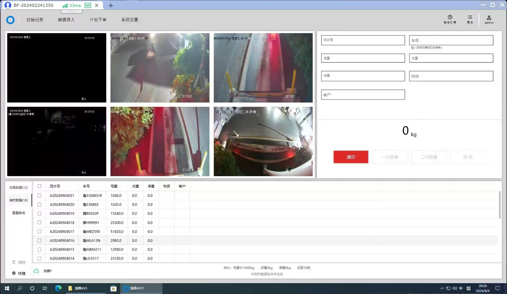
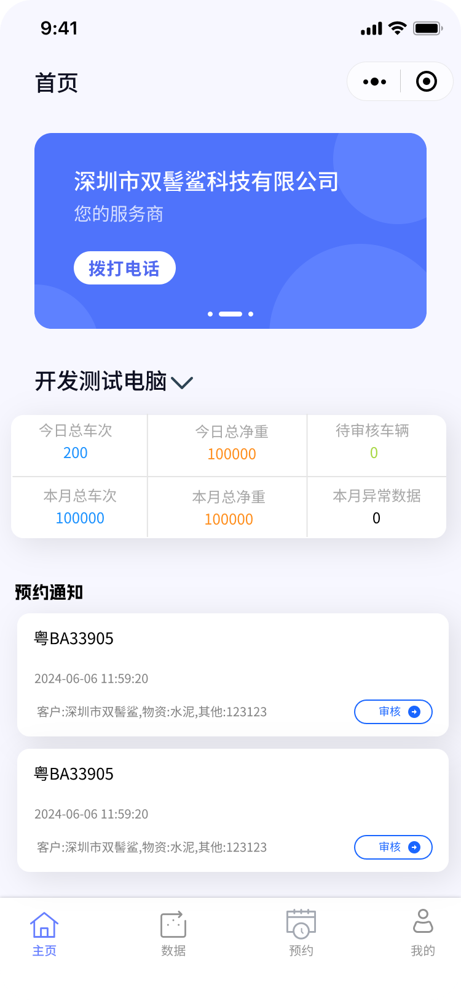
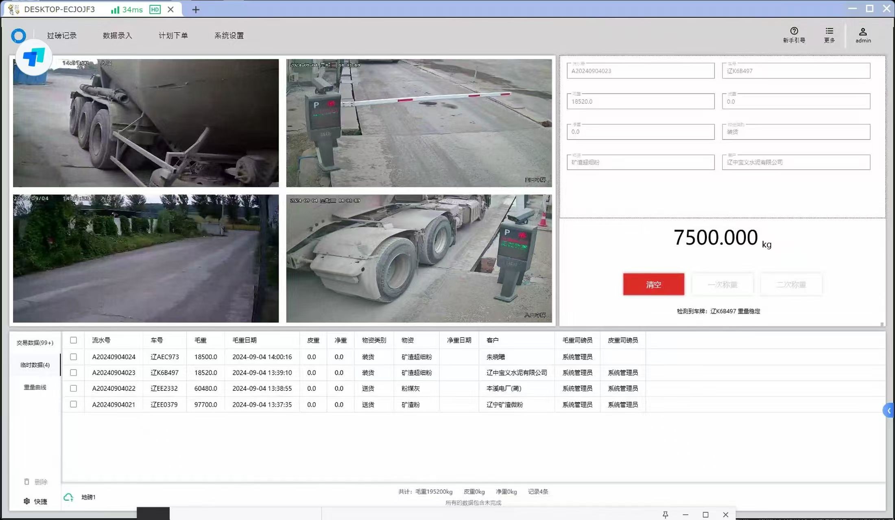

# 称重软件地磅汽车衡称重系统道闸车牌识别称重系统

#### 介绍
 
名称：篮圈AVS1  
版本：3.1.0.0  
开发者：靓仔  
发布日期：2024-03-20  
联系方式：18565665465  
  
#### 软件Nuget包版本：  
Aliyun.OSS.SDK: 2.13.0  
Aspose.Cells: 8.7.1  
Dapper: 1.50.2  
EntityFramework: 6.4.4  
FluentValidation: 8.6.0  
gong-wpf-dragdrop: 2.2.0  
Google.Protobuf: 3.21.9  
MahApps.Metro: 1.6.5  
Microsoft.Extensions.Logging.Abstractions: 2.2.0  
Newtonsoft.Json: 13.0.3  
NPOI: 2.4.1  
System.Runtime: 4.3.1  
等更多...  
#### 安装教程  
下载软件压缩包并解压。    
双击运行“运行称重软件3.0.exe”可执行文件。  
软件将自动在桌面创建快捷方式。  
默认登录账号“admin”及密码“123”。  
#### 功能说明  
软件已对接各大仪表，可直接使用。    
支持车牌识别技术，新增多个知名品牌支持。  
快速连接功能，通过IP地址自动连接。  
兼容性强，整合西门子PLC控制系统及身份证阅读器。  
新增多功能一体机，简化操作流程。  
#### 具备以下核心功能：  
1.车牌识别：自动识别车牌，实现上磅自动操作。  
2.称重抓拍：自动记录称重瞬间，确保数据真实性。  
3.车轴智能计算：智能识别车轴数，准确计算车辆重量。  
4.大屏幕显示：称重信息清晰显示，便于监控和记录。  
5.一机双衡：兼容市面上95%以上的仪表，实现无缝对接。  
6.个性化定制与便捷操作：  
7. 磅单自定义：根据需求定制磅单格式，提升数据管理效率。  
8. 自动计算：内置公式字段，自动计算重量数据。  
9. 打印支持：先预览再打印或直接打印，满足不同打印需求。  
10. 扣重功能：灵活处理扣重事宜，确保称重准确性。  
11. 断网称重：即使断网，也能通过扫码方式完成称重。  

安全与效率提升：  
12. 道闸控制：单向或双向道闸控制，提高通行效率。  
13. 开闸控制：支持相机或控制器直接开闸，简化操作流程。  
14. 光栅防作弊：防止非法进入，确保称重过程的公正性。  
15. 数据同步：实时同步数据，保障信息的一致性。  
16. 语音播报：支持自定义语音播报，提升用户体验。  
17. 超载控制：自动报警并控制超载车辆，保障安全。  

支付与出入管理：  
18. 在线支付：支持过磅收费在线支付，提高结算效率。  
19. 电子围栏：未称重完成禁止出场，确保流程规范。  
20. 数据备份：提供手动和自动数据备份，保障数据安全。  

其他功能开发进度：  

1.自动计算皮重毛重：智能计算货物净重，提高称重效率。  
2,磅单自定义：支持Excel磅单高度自定义，满足个性化需求。  
3.硬件支持：基本硬件已全面支持，确保系统稳定运行。  
4.定制化服务：提供定制化解决方案或源代码获取服务。  
5.ERP系统集成：可接入各种ERP系统，实现数据整合。  
6.在线更新：支持在线更新，保持软件最新状态。  
7.云端服务：提供云端备份数据、设置调试日志等功能。  
8.云端预约：支持司机通过扫码进行云端预约。  
9.源头治超平台接入：支持部分源头治超平台，提升管理效率。  
10.软件远程管理：支持远程管理软件，可设置有效期转让等。  
 
其他源代码
1.小程序源代码:https://gitee.com/Wennuannuan/Mqtt  
#### 图片
    
   
   
